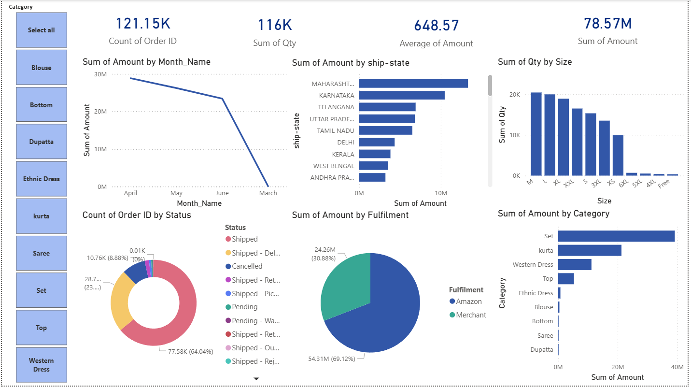

# 🛒 Amazon Sales Dashboard

📌 Project Overview
This project analyzes Amazon Sales data from Kaggle using Python and Power BI to find key business insights for an Indian fashion e-commerce business.

🛠️ Tools Used
- **Python** (Google Colab) — Data Cleaning & Analysis
- **Pandas Library** — Data Manipulation
- **Power BI Desktop** — Dashboard & Visualization

📊 Dashboard Preview

💡 Key Business Insights
- 💰 Total Revenue      : **₹7.85 Crore**
- 📦 Total Orders       : **1,13,004**
- 📫 Average Order      : **₹648.57**
- 🏆 Best Category      : **Set (₹3.91 Cr)**
- 🌍 Best State         : **Maharashtra**
- 🏙️ Best City          : **Bengaluru**
- ❌ Cancellation Rate  : **8.4%**
- 👗 Popular Size       : **M Size**
- 📅 Best Month         : **April**
- 🚚 Top Fulfilment     : **Amazon (69%)**

📁 Files in This Repository
| File | Description |
|------|-------------|
| `Amazon_Sales_Dashboard.pbix` | Power BI Dashboard |
| `amazon_dashboard.png` | Dashboard Screenshot |

🔄 Project Steps
1. Downloaded Amazon Sales dataset from Kaggle
2. Loaded and cleaned data using Python in Google Colab
3. Removed 7,826 rows with missing values
4. Added new columns — Month, Year, Month_Name
5. Analyzed KPIs, Categories, States, Sizes
6. Exported clean CSV to Power BI
7. Built interactive dashboard in Power BI
8. Published to GitHub Portfolio

📊 Dataset
Dataset contains 1,28,975 rows of Amazon India
fashion sales data from April to June 2022.

Download dataset from Kaggle:
[Amazon Sales Dataset](https://www.kaggle.com/datasets/thedevastator/unlock-profits-with-e-commerce-sales-data)

## 📬 Connect With Me
- LinkedIn: [Sai Sri Kadari](https://www.linkedin.com/in/sai-sri-kadari-229a2b230)
- Email: saisrijagadish36@gmail.com
- GitHub: [saisrijagadish36-cmd](https://github.com/saisrijagadish36-cmd)
